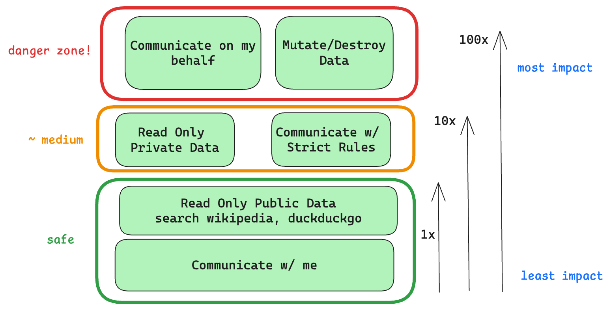
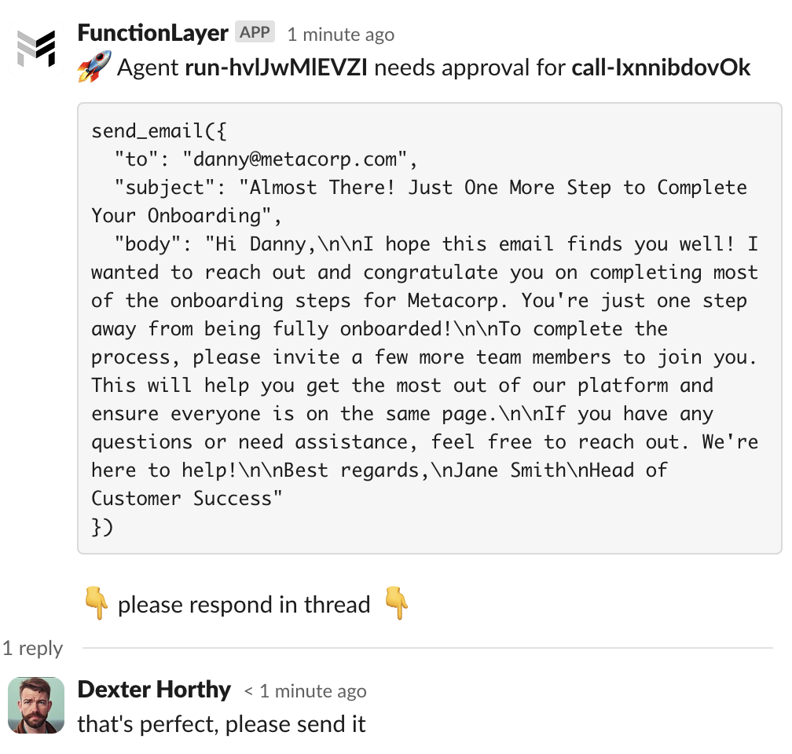

<div align="center">


# **HumanLayer Docs**

</div>

Table of Contents:

- [Getting Started](#getting-started)
- [Concepts](#concepts)
  - [Functions and Tools](#functions-and-tools)
  - [High Stakes Functions](#high-stakes-functions)
  - [Approvals](#approvals)
  - [Human As Tool](#human-as-tool)
  - [Contact Channels](#contact-channels)
- [Features](#features)
  - [Function Decorators](#function-decorators)
  - [Human as Tool](#human-as-tool)
  - [HumanLayer CLI](#cli-mode)
  - [HumanLayer Cloud](#humanlayer-cloud)
- [Reference](#reference)

## Getting Started

**[Getting Started Guide](./getting-started.md)**

To get started, check out [Getting Started](./getting-started.md) or jump straight into one of the [Examples](../examples):

- 🦜⛓️ [LangChain](../examples/langchain/)
- 🚣‍ [CrewAI](../examples/crewai/)
- 🦾 [ControlFlow](../examples/controlflow/)
- 🧠 [Raw OpenAI Client](../examples/openai_client/)

## Concepts

### Functions and Tools

Functions and tools are a very powerful element of "Agentic Workflows" in AI. Dupont's excellent [Transforming ](https://louis-dupont.medium.com/transforming-software-interactions-with-tool-calling-and-llms-dc39185247e9).

In the AI context, a function is just a generic python function that you've written. Information about this function like name, description, parameters, and types are passed to the AI model as a "tool". The AI model can then indicate that it would like call this function as part of its reasoning process.

[](https://louis-dupont.medium.com/transforming-software-interactions-with-tool-calling-and-llms-dc39185247e9)

_From https://louis-dupont.medium.com/transforming-software-interactions-with-tool-calling-and-llms-dc39185247e9_

From the [OpenAI docs](https://platform.openai.com/docs/guides/function-calling)

> Under the hood, functions are injected into the system message in a syntax the model has been trained on

When a tool call is selected by the LLM, it is the responsibility of the client code or framework to actually cal the function and send the result back to the LLM.

An example tool calling workflow might look like

> **System**: You are a helpful assistant. You have access to the function: `check_weather_in_city(name: str) -> dict`

> **User**: What's the weather in San Francisco?

> **Assistant**: `__tool_call(check_weather_in_city, {"name": "San Francisco"})`

At this point, your code would call the function, and add the result to the chain, and send the whole conversation back to the LLM

> **Tool**: `{"temperature_farenheit": "72", "weather": "sunny"}`

The LLM can then produce a response based on the results of the tool call:

> **Assistant**: "The weather in San Francisco is 72 degrees and sunny!"

> **User**: "Thanks!"

Learn more:

- [Function Calling - OpenAI Docs](https://platform.openai.com/docs/guides/function-calling)
- Louis Dupont's excellent [Transforming Software Interactions with Tool Calling and LLMs](https://louis-dupont.medium.com/transforming-software-interactions-with-tool-calling-and-llms-dc39185247e9)
- [Leverage OpenAI Tool Calling: Building a Reliable AI Agent from Scratch](https://towardsdatascience.com/leverage-openai-tool-calling-building-a-reliable-ai-agent-from-scratch-4e21fcd15b62)
- [How Does Tool Calling Work in Langchain](https://blog.langchain.dev/tool-calling-with-langchain/)
- [Tool Calling in Crew AI](https://docs.crewai.com/core-concepts/Tools/)
- [The Berkeley Function Calling Leaderboard](https://www.alexanderjunge.net/blog/function-calling-leaderboard/)

### High Stakes Functions

Some functions are riskier than others. To define what we mean by "high stakes", some examples:

- **Low Stakes**: Read Access to public data (e.g. search wikipedia, access public APIs and DataSets)
- **Low Stakes**: Communicate with agent author (e.g. an engineer might empower an agent to send them a private Slack message with updates on progress)
- **Medium Stakes**: Read Access to Private Data (e.g. read emails, access calendars, query a CRM)
- **Medium Stakes**: Communicate with strict rules (e.g. sending based on a specific sequence of hard-coded email templates)
- **High Stakes**: Communicate on my Behalf or on behalf of my Company (e.g. send emails, post to slack, publish social/blog content)
- **High Stakes**: Write Access to Private Data (e.g. update CRM records, modify feature toggles, update billing information)



The High stakes functions are the ones that are the most valuable and promise the most impact in automating away human workflows, but they are also the riskiest if used incorrectly.

### Approvals

FunctionLayer provides a set of decorators that can be used to add approval requirements to specific functions.

```python
@hl.require_approval()
def send_email(to: str, subject: str, body: str):
  """Send an email to the customer"""
  ...
```

When a function requiring approval is triggered, the execution will block until an approval is received from a human. These approvals can be routed and received via API, Web Application, Slack, Email, or any other channel that HumanLayer supports. Here's an example slack approval:



If the function is rejected, the LLM will receive a message indicating that the function was not executed and include the feedback and context from the user. For example:

> Error running send_email: User denied send_email with message: that's wrong, sign it as Jane Smith, Head of Customer Success

### Human As Tool

In addition to gating function calls, HumanLayer can also provide a more generic "human as tool" function for an agent to reach out across various channels.

```python
from humanlayer import ApprovalMethod, ContactChannel, HumanLayer, SlackContactChannel

hl = HumanLayer(approval_method=ApprovalMethod.CLOUD)

customer_success_direct_message = ContactChannel(
  slack=SlackContactChannel(
    channel_or_user_id="U01JQX9KZZ",
    context_about_channel_or_user="a DM with the head of customer success",
  )
)

ceo_direct_message = ContactChannel(
  slack=SlackContactChannel(
    channel_or_user_id="U09J9CV8ZX",
    context_about_channel_or_user="a DM with the CEO",
  )
)

# made up function, use whatever framework you want
run_llm_task(
  prompt="Determine the top objectives for the customer success org and send them to the CEO",
  tools=[
    hl.human_as_tool(customer_success_direct_message),
    hl.human_as_tool(ceo_direct_message)
  ],
  llm=OpenAI(model="gpt-4o")
)
```

You can add as many of these "human as tool" functions as you like to your LLM toolset. The AI will see a function with the signature

```
contact_human_in_a_dm_with_the_head_of_sales(msg: str) -> str
```

### Contact Channels

FunctionLayer defines the concept of a Contact Channel, which is a way to route agent requests to the right person or group of people. Some example contact channels might be:

- "A Slack channel with the AI Engineering team"
- "A DM with the head of marketing"
- "An email to the director of engineering"

If you use HumanLayer Cloud, you can define a default contact channel at the Project level, or you can define custom contact channels per function or tool:

```python

dm_sales = ContactChannel(
    slack=SlackContactChannel(
        channel_or_user_id="U01JQX9KZZ",
        context_about_channel_or_user="a DM with the head of sales",
    )
)

dm_engineering = ContactChannel(
  discord=DiscordContactChannel(
    channel_or_user_id="U02ZJXQKZ9",
    context_about_channel_or_user="a channel with the site reliability engineering team",
  )
)

fl_default = HumanLayer(approval_method=ApprovalMethod.CLOUD)

fl_sales = HumanLayer(
    approval_method=ApprovalMethod.CLOUD,
    contact_channel=dm_sales,
)

@hl_default.require_approval() # uses project default contact channel
def send_email(to: str, subject: str, body: str):
  """Send an email to the customer"""
  ...

@hl_sales.require_approval() # uses the sales contact channel
def update_crm_record(opportunity_id: str, status: str):
  """Update the CRM record for the opportunity"""
  ...

@hl_default.require_approval(dm_engineering) # uses the engineering contact channel
def drop_production_database(database_name: str):
  """Drop the specified database"""
  ...
```

The same is possible for "human as tool" functions:

```python
tools = [
   fl_default.human_as_tool(),
   fl_sales.human_as_tool(),
   fl_default.human_as_tool(dm_engineering),
]
```

### Side Note - Asynchronous Agents

The elephant in the room here is the "block until approval is reached" - in conventional LLM frameworks, that means you have a python worker sitting in a wait loop, blocking the execution of the chain until a response is received from a human. This is not ideal for a number of reasons.

One of the goals of the Function Layer project is to work with the community and framework builders to find the right implementation for asynchronous agent workflows, where tool calls or other operations might need to pause a conversation thread for hours or days.

There's lots of open questions in this space, including how and when we want LLM agents to interrupt us and by what channels. We'll save these for a future, perhaps more philosophical, discussion.

## Features

### Function Decorators

FunctionLayer provides a set of decorators that can be used to add human in the loop functionality to your functions. Rather than relying on LLM reasoning and logic to determine which functions to call and how to do it safely, you can move the approval out of the LLM layer and into the function layer. This brings strict determinism the "if/when" of an LLM asking for human approval on sensitive actions.

```python
import os

from humanlayer import HumanLayer

hl = HumanLayer(api_token=os.getenv("FUNCTIONLAYER_API_TOKEN"))

@hl.require_approval()
def send_email_to_customer(email: str, subject: str, body: str) -> str:
  """
  send an email to the customer
  """
  ... # function body
  return f"Successfully sent email '{subject}' to {email}"
```

This will cause a message to be sent to a configured channel, e.g. a particular user or channel in slack.

#### Customizing approval routing

You may want to customize which channel or user the approval request is sent to. You can do this by passing a `ContactChannel` object to the `require_approval` decorator.

```python
from humanlayer import ContactChannel, SlackContactChannel

head_of_sales = ContactChannel(
  slack=SlackContactChannel(
    channel_or_user_id="U01JQX9KZZ",
    context_about_channel_or_user="a DM with the head of sales",
  )
)

@hl.require_approval(head_of_sales)
def send_email_to_customer(email: str, subject: str, body: str) -> str:
    ...
```

### Human as Tool

In addition to blocking function execution based on human feedback, functionlayer can also provide a more generic "human as tool" function for an agent to reach out across various channels.

```python
from humanlayer import ContactChannel, HumanLayer, SlackContactChannel
hl = HumanLayer()

tools = [
    hl.human_as_tool(
        ContactChannel(
            slack=SlackContactChannel(
                channel_or_user_id="U01JQX9KZZ",
                context_about_channel_or_user="a DM with the head of sales",
            )
        )
    ),
    hl.human_as_tool(
        ContactChannel(
            slack=SlackContactChannel(
                channel_or_user_id="CQZIQ0X9KZZ",
                context_about_channel_or_user="the primary channel for the us-west account team",
            )
        )
    ),
]
```

this builds a function that can be passed to `langchain.tools.StructuredTool.from_function()` or any other LLM framework's tool calling system. The AI will see a function with the signature

```
contact_human_in_a_dm_with_the_head_of_sales(msg: str) -> str
```

See [Langchain Human as Tool Example](../examples/langchain/03-human_as_tool.py) for an example of how to use this in a Langchain context.

### Functionlayer Cloud

By default, HumanLayer will run in [CLI mode](#cli-mode), which allows a human to interact with the LLM via the command line. However, HumanLayer really shines in cloud mode, where humans can be pulled into the agentic loop via email, slack, or other integrations.

To get started with FuntionLayer Cloud, get an API token from https://app.humanlayer.dev and set it in your environment

```
export FUNCTIONLAYER_API_TOKEN=
```

then initialize HumanLayer with `ApprovalMethod.CLOUD`

```python
from humanlayer import ApprovalMethod, HumanLayer
hl = HumanLayer(approval_method=ApprovalMethod.CLOUD)
```

See [Getting Started](./getting-started.md) for more information on how to set up and use HumanLayer Cloud.

#### Slack Notifications

To enable Slack notifications, you'll need to set up a Slack app and set a bot token in functionlayer, or install the functionlayer Slack app. See [configuring slack](./configuring-slack.md) for more detail.

### CLI Mode

The functionlayer CLI mode allows for a local development mode whereby all "human in the loop" and "human as tool" will be assesed as simple python `input()` calls.

It can be a good way to experiment with LLM workflows without needing to integrat slack, email, or any of the [HumanLayer Cloud](#functionlayer-cloud) components.

to run in CLI mode, initialize HumanLayer with `ApprovalMethod.CLI`

```python

from humanlayer import HumanLayer, ApprovalMethod

hl = HumanLayer(approval_method=ApprovalMethod.CLI)

```

Then, you can decorate your functions as normal.

```python
@hl.require_approval()
def send_email_to_customer(email: str, subject: str, body: str) -> str:
    """
    send an email to the customer
    """
    ... # function body
    return f"Successfully sent email '{subject}' to {email}"
```

When the LLM calls this function, a prompt will be shown on the CLI asking for approval. A user can hit ENTER to continue, or type feedback to reject the function.

## Architecture

🚧Coming Soon 🚧

## Reference

🚧Coming Soon 🚧
